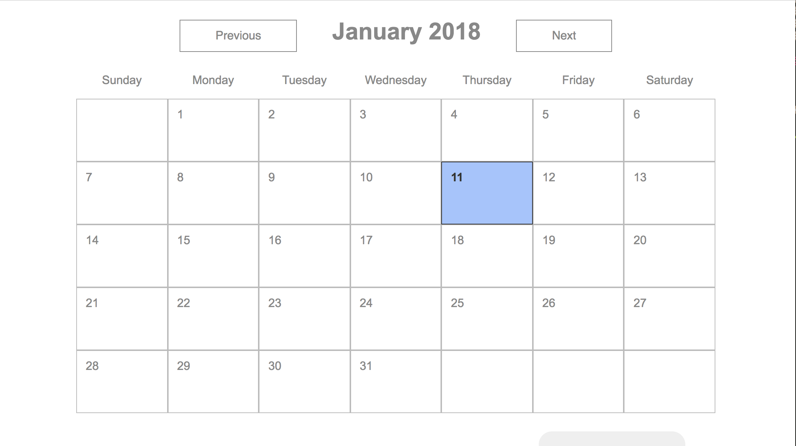

# react-calendar-example

## What Is It? 

**react-calendar-example** shows techniques for building a calendar with React.

[Check it out at ](https://github.com/cswagerty/react-calendar)

## What Can It Do?

- Users can change the current month
- Calendar defaults to the current month with today highlighted
- Displays days in appropriate weekday column

## What It Looks Like

## Technical Highlights

- React state updates days in month without explicit DOM manipulation
- Organized to encapsulate functionality to a component (Calender, Month, Day, etc.)
- Styled using advanced CSS techniques including `display: grid`, Sass variables/mixins, and CSS imported via JS
- Created simple build configuration with Webpack and package.json

## Tech Stack

- React (JSX)
- Sass
- Webpack

## How to Run Locally

1. Clone the repo
2. run `npm install`
3. run `npm start`
4. go to `http://localhost:8080/`

